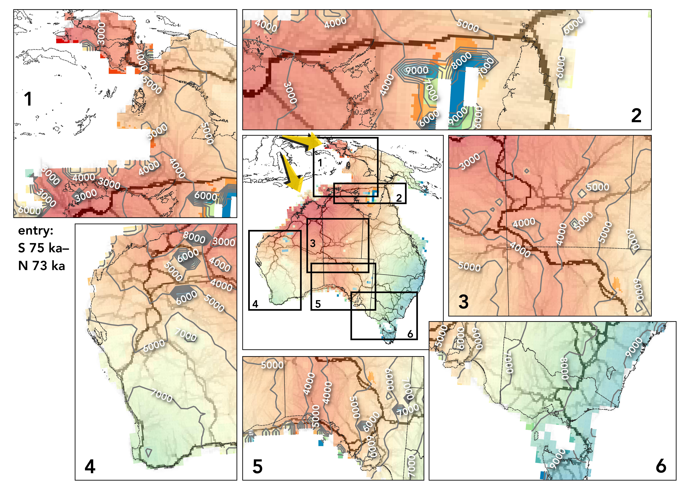
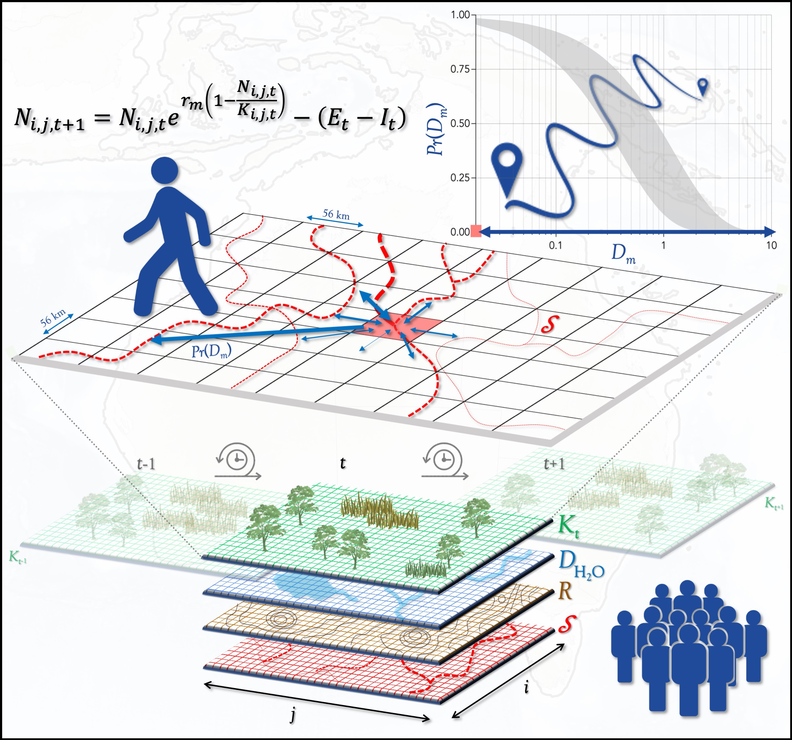

# Directionally supervised cellular automaton for the initial peopling of Sahul

 
‘Superhighways’ of human movement in Sahul1 combined with a demographic cellular automaton2 

 
Data and R code associated with the paper:

 
 
<a href="http://scholar.google.com.au/citations?sortby=pubdate&hl=en&user=1sO0O3wAAAAJ&view_op=list_works">BRADSHAW, CJA</a>, <a href="https://stefanicrabtree.com/about-stefani/">SA CRABTREE</a>, <a href="https://santafe.edu/people/profile/devin-white">DA WHITE</a>, <a href="https://research.jcu.edu.au/portfolio/sean.ulm">S ULM</a>, <a href="https://research.jcu.edu.au/portfolio/michael.bird">MI BIRD</a>, <a href="https://www.emmconsulting.com.au/about/leadership-team/dr-alan-william-2/">AN WILLIAMS</a>, <a href="http://www.flinders.edu.au/people/frederik.saltre">F SALTRÉ</a>. 2023. <a href="http://doi.org/10.1016/j.quascirev.2023.107971">Directionally supervised cellular automaton for the initial peopling of Sahul</a>. <em>Quaternary Science Reviews</em> doi:10.1016/j.quascirev.2023.107971

An earlier version of the manuscript is available as a preprint at <em>OSF Preprints</em> doi:<a href="http://doi.org/10.31219/osf.io/a45fw">10.31219/osf.io/a45fw</a> (2022)

## Abstract
Reconstructing the patterns of <em>Homo sapiens</em> expansion out of Africa and across the globe has been advanced using demographic and travel-cost models. However, modelled routes are <em>ipso facto</em> influenced by migration rates, and vice versa. We combined movement ‘superhighways’ with a demographic cellular automaton to predict one of the world’s earliest peopling events — Sahul between 75,000–50,000 years ago. Novel outcomes from the superhighways-weighted model include (<em>i</em>) an approximate doubling of the predicted time to continental saturation (~ 10,000 years) compared to that based on the directionally unsupervised model (~ 5,000 years), suggesting that rates of migration need to account for topographical constraints in addition to rate of saturation; (<em>ii</em>) a previously undetected movement corridor south through the centre of Sahul early in the expansion wave based on the scenarios assuming two dominant entry points into Sahul; and (<em>iii</em>) a better fit to the spatially de-biased, Signor-Lipps-corrected layer of initial arrival inferred from dated archaeological material. Our combined model infrastructure provides a data-driven means to examine how people initially moved through, settled, and abandoned different regions of the globe. 

 
Prof <a href="http://scholar.google.com.au/citations?sortby=pubdate&hl=en&user=1sO0O3wAAAAJ&view_op=list_works">Corey J. A. Bradshaw</a>  
<a href="http://globalecologyflinders.com" target="_blank">Global Ecology</a>, <a href="http://flinders.edu.au" target="_blank">Flinders University</a>, Adelaide, Australia  
May 2022 / updated October 2022  
<a href=mailto:corey.bradshaw@flinders.edu.au>e-mail</a>  
 
1Crabtree, S.A. et al. <a href="http://doi.org/10.1038/s41562-021-01106-8">Landscape rules predict optimal super-highways for the first peopling of Sahul</a>. <strong><em>Nature Human Behaviour</strong></em> 5:1303-1313, doi:10.1038/s41562-021-01106-8 (2021) (see also relevant <a href="https://github.com/dawhite/sfa">Github repository</a>) 
2Bradshaw, C.J.A. et al. <a href="http://doi.org/10.1038/s41467-021-21551-3">Stochastic models support rapid peopling of Late Pleistocene Sahul</a>. <strong><em>Nature Communications</strong></em> 12:2440, doi:10.1038/s41467-021-21551-3 (2021) (see also relevant <a href="https://github.com/cjabradshaw/SahulHumanSpread">Github repository</a>)

## Code
The R file <a href="https://github.com/cjabradshaw/SuperhighwaysSpreadModel/blob/main/code/SHSpreadPathGithub.R"><code>SHSpreadPathGithub.R</code></a> in the <a href="https://github.com/cjabradshaw/SuperhighwaysSpreadModel/tree/main/code"><code>Code</code></a> directory produces average scenario outputs over a set number of iterations. The user can choose the particulars of the scenario (e.g., underlying <em>K</em>~NPP relationship, entry time(s), entry point(s), spatial clustering, stochastic variances, minimum viable population thresholds, etc.)

The file <a href="https://github.com/cjabradshaw/SuperhighwaysSpreadModel/blob/main/code/matrixOperators.r"><code>matrixOperators.R</code></a> includes necessary functions and is sourced directly within the R code file.

## Data
The two zipped files (<code>CSV files.zip</code> and <code>TIF files.zip</code>) in the <a href="https://github.com/cjabradshaw/SuperhighwaysSpreadModel/tree/main/data"><code>data</code></a> directory should be decompressed and their files placed in the same directory as the R code.
 
 
Also note that the original archaeological data used to validate both the unsupervised cellular automaton in <a href="http://doi.org/10.1038/s41467-021-21551-3">Bradshaw et al. (2021)</a> and the superhighways model of <a href="https://www.nature.com/articles/s41562-021-01106-8">Crabtree et al. (2021)</a> can be accessed using these two links: <a href="https://github.com/cjabradshaw/SahulHumanSpread/blob/master/Archaeology%20sites%20%26%20dates%20used%20for%20comparison%20layers.xlsx">Archaeological Sites and Dates</a> (Bradshaw et al. 2021); <a href="https://static-content.springer.com/esm/art%3A10.1038%2Fs41562-021-01106-8/MediaObjects/41562_2021_1106_MOESM3_ESM.xlsx">Supplementary Table 8</a> (Crabtree et al. 2021)

